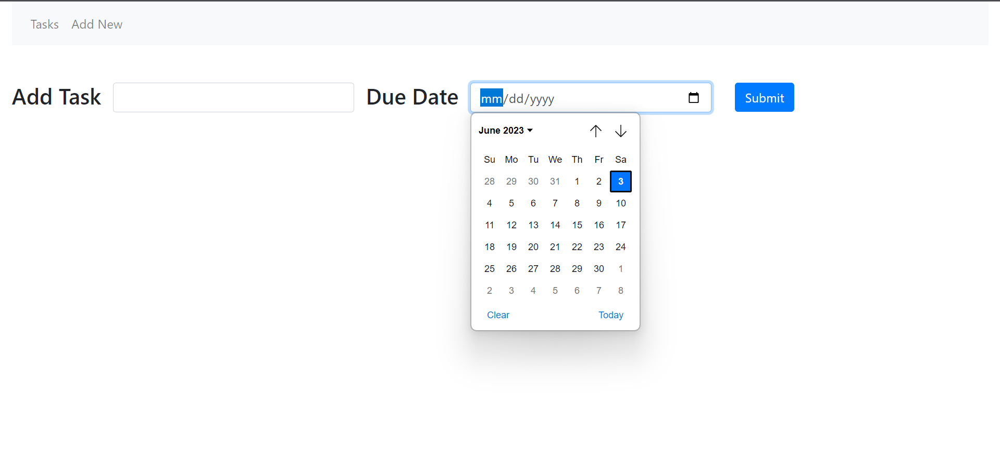
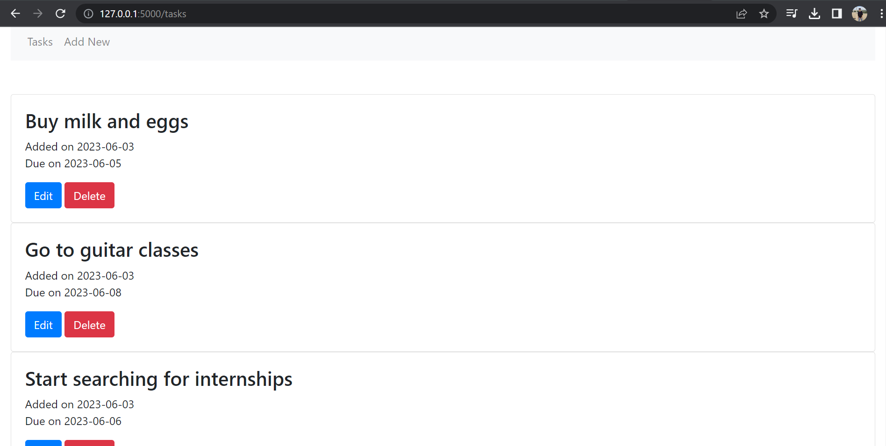
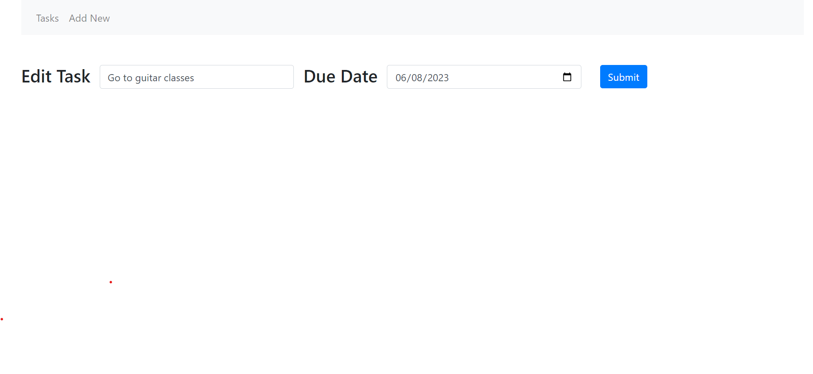
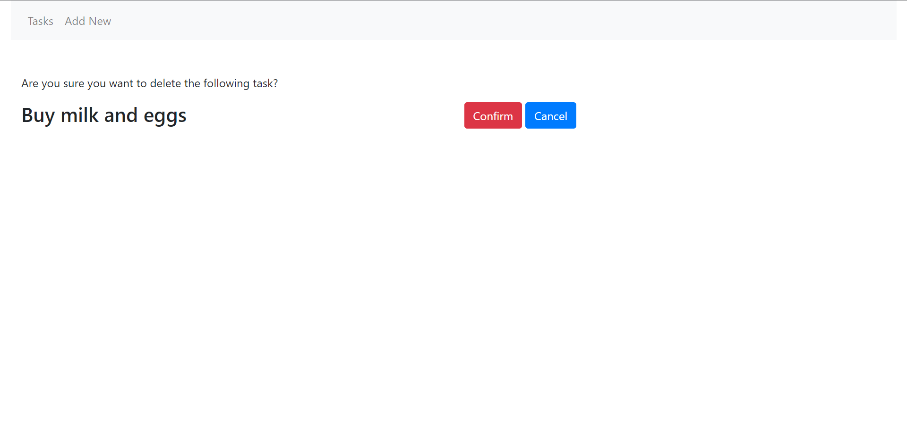

# TODO-Web-App-using-Flask-and-HTML
The TODO Web Application is a Flask-based backend project developed in collaboration with a Web Developer. It provides users with a seamless task management experience, allowing them to effortlessly add, edit, and delete tasks. The application aims to improve task management efficiency, resulting in a 20% increase in productivity.

### Features
1. Add, edit, and delete tasks with ease.  
2. Integrated SQLITE database using sqlalchemy for efficient data storage and retrieval.  
3. Created forms using WTF forms in Flask

### Usuage
1. Clone the repository: git clone [https://github.com/onkar-99/TODO-Web-App-using-Flask-and-HTML](https://github.com/onkar-99/TODO-Web-App-using-Flask-and-HTML)
2. Navigate to the project directory: cd todo-web-app
3. Install the required libraries such as flask, flask_sqlalchemy, flask_wtf. 
4. Run app.py by entering the command python app.py in command prompt.
5. Navigate to the url mentioned in the command prompt output. 

### Examples
#### 1. Add New Task

#### 2. View Tasks

#### 1. Edit Task

#### 2. Delete Task

